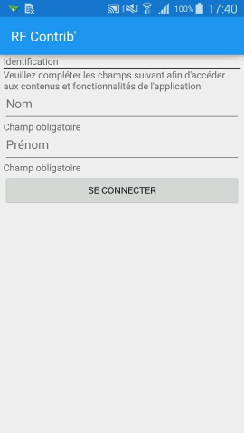
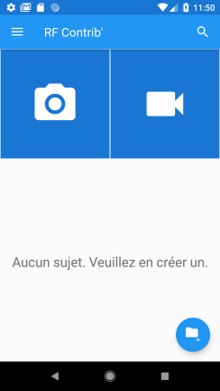
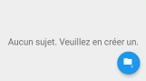
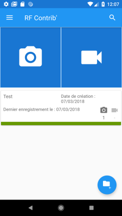

# RfContrib Documentation Utilisateur

## Contenu
- [Présentation](#presentation)

- [Prise en main rapide](#prise-en-main-rapide)
- [Lancement](#lancement)
- [Identification](#identification)
- [Écran principal](#écran-principal)
   - [Barre d'icônes](#barre-d'icônes)
   - [Tuiles de captation](#tuiles-de-captation)
   - [Zone de gestion des sujets](#zone-de-gestion-des-sujets)
- [Menu principal](#menu-principal)
## Présentation
L’application RFContrib’ permet la capture de photos et vidéos depuis un smartphone dans le but de les mettre à disposition d’Orphea, la photothèque centralisée de Radio France.

Les photos et vidéos capturés peuvent et *doivent* être groupées dans des reportages. Dans RfContrib les reportages sont désignés sous le nom de _sujets_. Ils seront appelés ainsi dans le reste de cette documentation d'aide.

## Prise en main rapide

1. Renseigner le *Nom* et le *Prénom*, il servira à renseigner le crédit des photos et vidéos que vous allez soumettre à Orphea.
2. Créez un *sujet* si ce n'est déjà fait, en cliquant sur le bouton d'ajout du sujet.

### Prendre une photo/vidéo et l'envoyer
1. Prenez une photo ou une vidéo en cliquant sur la tuile Photo ou Vidéo correspondante.
2. Validez la capture de la photo en cliquant sur *OK*.
3. Donnez une légende à votre photo.
4. Validez la saisie des champs de la photo.
5. Envoyer la photos vers Orphea en cliquant sur le bouton d'envoi.

### Importer une photos/vidéo et l'envoyer
1. Sur l'écran d'accueil, si aucun sujet n'est encore créé, vous devez en créer un.
2. Dans la zone de gestion des sujets, cliquez sur le sujet auquel vous souhaitez ajouter une photo/vidéo.
3. Dans l'écran du sujet, cliquez sur le bouton d'Import situé en haut à droite de l'écran.
4. Dans la boîte de dialogue _Importer_ sélectionnez Photo ou Vidéo selon le média que vous voulez importer depuis votre smartphone.
5. La gallerie de photos/vidéo de votre smartphone va s'ouvrir. Recherchez et sélectionnez la photos/vidéo à importer, puis cliquer sur _Ouvrir_.
6. Donnez une légende à votre photo/vidéo.
7. Validez la saisie des champs.
8. Envoyez la photo/vidéo vers Orphea en cliquant sur le bouton d'envoi.

## Lancement
Une fois installée, l’application est disponible dans l’écran d’accueil du smartphone.

Si vous ne trouve pas l'icone, utilisez le moteur de recherche dans votre téléphone pour rechercher l'applicationn nommée _RfContrib_.

Une fois trouvée vous pouvez cliquez longuement sur l'icône, un menu déroulant devrait s'afficher et vous proposer de créer un raccourci vers cette application sur l'écran d'accueil.

## Identification

A la première ouverture, il est nécessaire de s’identifier en renseignant son nom et prénom, lesquels seront utilisés pour vous identifier en tant qu’auteur des photos et vidéos lorsque ces médias seront transférés vers Orphea.

Vous devez renseigner toutes les informations demandées puis cliquer sur _Se Connecter_

## Écran principal

L’écran principal présente :

- une *barre d’icônes* en haut de l’écran, 
- les *tuiles de captation* permettant de déclencher la capture d’une photo ou d'une vidéo
- la *zone de gestion* des sujets. Un bouton situé au bas de la liste des sujets permet à tout moment d’ajouter un nouveau sujet.

_Remarque :  lors de la première ouverture cette liste est vide avec un message indiquant qu’aucun sujet n’est encore créé._

### Barre d'icônes

La barre d'icônes en haut de l'écran vous permet d'accéder au menu principal de l'application via le _bouton "burger"_

Le *bouton de recherche* vous permet de retrouver des médias et sujets que vous avez déjà rentrés en effectuant une recherche par mots clés.

### Tuiles de captation

Les tuiles de captation permettent de démarrer une prise de photos ou l'enregistrement d'une vidéo.

### Zone de gestion des sujets
 
En dessous des tuiles de captation vous y verrez la zone de gestion des sujets. La toute première fois vous y verrez cette zone vide avec le message « Aucun sujet. Veuillez en créer un. »

Si des sujets sont déjà disponibles, ils apparaissent sous forme de tuiles de sujets, en dessous des tuiles de captation.

Le dernier sujet auquel a été ajouté une photos ou vidéo apparait en haut de la liste.

## Menu principal

Le menu principal est affiché en cliquant sur l'icône du menu principal.
Une fois que ce menu est affiché, il suffit de balayer le menu vers la gauche pour le masquer.

Le menu princpial donne accès aux actions suivantes:
-	Changer d’utilisateur
-	Créer un sujet
-	Galerie : afficher l’accueil de la galerie de photos et vidéos déjà captées avec RfContrib’
-	Photos : afficher l’onglet « Photos » de la galerie
-	Vidéos : afficher l’onglet « Vidéos » de la galerie
-	Mode Transfert : activer l’accès depuis un navigateur aux photos et vidéos captées avec RfContrib’
-	Paramètres : afficher l’écran de paramètres de l’application

Le menu princpial, donne égalgmeent un aperçu de l'espace de stockage disponible.

En fonction de la taille de l’écran, il peut être nécessaire de faire défiler ces menus pour y accéder en intégralité.